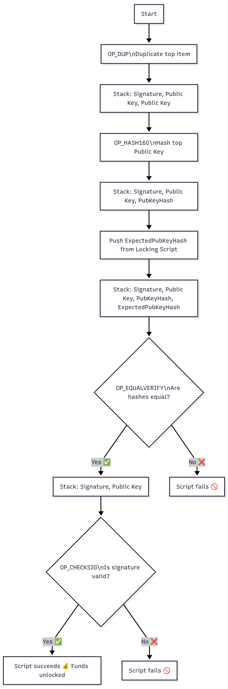

# Assignment A — Bitcoin Scripting

## Given Script

OP_DUP OP_HASH160 OP_EQUALVERIFY OP_CHECKSIG

This is the **standard Pay-to-PubKey-Hash (P2PKH)** script used in Bitcoin transactions. It ensures that only the owner of the private key corresponding to a given Bitcoin address can spend the funds.

---

## 🔍 Step-by-Step Breakdown of Each Opcode

| Opcode | Meaning | Purpose |
|--------|---------|---------|
| **OP_DUP** | Duplicates the top item on the stack | Creates a copy of the public key so that one copy can be hashed while the other is used later for signature verification |
| **OP_HASH160** | Performs SHA-256 followed by RIPEMD-160 on the top stack item | Converts the duplicated public key into its **public key hash**, which is compared to the hash in the locking script |
| **OP_EQUALVERIFY** | Checks if the top two stack items are equal; if not, the script fails | Verifies that the public key hash from the unlocking script matches the hash stored in the locking script |
| **OP_CHECKSIG** | Uses the provided public key and signature to verify authenticity | Ensures that the signature corresponds to the given public key and the transaction data, confirming the rightful spender |

---

## 🧠 Data Flow Diagram

Below is a conceptual view of how data moves through the Bitcoin stack during script execution:

---

## 🚨 What Happens if Signature Verification Fails?

- The **`OP_CHECKSIG`** operation will **fail**, causing the **entire transaction to be invalid**.  
- Bitcoin nodes will **reject the transaction** during validation.  
- No funds are transferred; the coins remain locked in the previous UTXO.  

👉 This protects Bitcoin from **unauthorized spending**.

---

## 🛡️ Security Benefits of Hash Verification

1. **Privacy:** The blockchain only stores the *hashed* public key, not the full public key, until it’s spent.  
2. **Efficiency:** Hashes are shorter (20 bytes vs 33 bytes), saving space on the blockchain.  
3. **Integrity:** A small change in the public key drastically changes the hash, making tampering detectable.  
4. **Security:** Even if a hash is known, the underlying public key cannot be reconstructed, ensuring cryptographic safety.

---

## ✅ Summary

| Step | Operation | Result |
|------|------------|---------|
| 1 | `OP_DUP` | Duplicates public key |
| 2 | `OP_HASH160` | Hashes the duplicated key |
| 3 | `OP_EQUALVERIFY` | Confirms correct key ownership |
| 4 | `OP_CHECKSIG` | Verifies digital signature |

Together, these opcodes form the **Pay-to-PubKey-Hash (P2PKH)** mechanism —  
the foundation of Bitcoin’s secure transaction validation.
